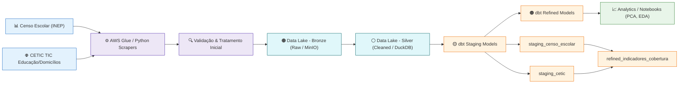

## 📊 Pipeline do Projeto

```mermaid
flowchart LR
CENSO["📊 Censo Escolar (INEP)"]
CETIC["🌐 CETIC TIC Educação/Domicílios"]
GLUE["⚙️ AWS Glue / Python Scrapers"]
VALID["🔍 Validação & Tratamento Inicial"]
BRONZE["🟤 Data Lake - Bronze (Raw / MinIO)"]
SILVER["⚪ Data Lake - Silver (Cleaned / DuckDB)"]
DBT_STG["🟡 dbt Staging Models"]
DBT_REF["🟠 dbt Refined Models"]
STG_CENSO["staging_censo_escolar"]
STG_CETIC["staging_cetic"]
REF_EX["refined_indicadores_cobertura"]
ANL["📈 Analytics / Notebooks (PCA, EDA)"]
CENSO --> GLUE
CETIC --> GLUE
GLUE --> VALID
VALID --> BRONZE
BRONZE --> SILVER
SILVER --> DBT_STG
DBT_STG --> DBT_REF
DBT_REF --> ANL
DBT_STG --> STG_CENSO
DBT_STG --> STG_CETIC
STG_CENSO --> REF_EX
STG_CETIC --> REF_EX
classDef source fill:#e3f2fd,stroke:#1565c0
classDef glue fill:#ede7f6,stroke:#512da8
classDef lake fill:#e0f7fa,stroke:#006064
classDef dbt fill:#fff3e0,stroke:#ef6c00
classDef analytics fill:#e8f5e9,stroke:#2e7d32
class CENSO,CETIC source
class GLUE,VALID glue
class BRONZE,SILVER lake
class DBT_STG,DBT_REF,STG_CENSO,STG_CETIC,REF_EX dbt
class ANL analytics
```