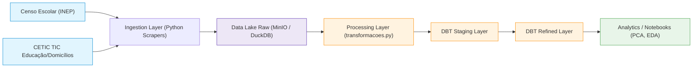

## 📊 Pipeline do Projeto

```mermaid
flowchart LR
CENSO["Censo Escolar (INEP)"]
CETIC["CETIC TIC Educação/Domicílios"]
ING["Ingestion Layer (Python Scrapers)"]
RAW["Data Lake Raw (MinIO / DuckDB)"]
PROC["Processing Layer (transformacoes.py)"]
STG["DBT Staging Layer"]
REF["DBT Refined Layer"]
ANL["Analytics / Notebooks (PCA, EDA)"]
CENSO --> ING
CETIC --> ING
ING --> RAW
RAW --> PROC
PROC --> STG
STG --> REF
REF --> ANL
classDef source fill:#e1f5fe,stroke:#0288d1
classDef storage fill:#ede7f6,stroke:#5e35b1
classDef process fill:#fff3e0,stroke:#fb8c00
classDef analytics fill:#e8f5e9,stroke:#43a047
class CENSO,CETIC source
class RAW storage
class PROC,STG,REF process
class ANL analytics
```