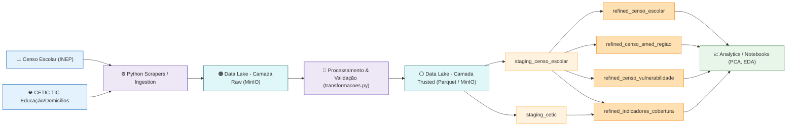

## 📊 Pipeline do Projeto

```mermaid
flowchart LR
CENSO["📊 Censo Escolar (INEP)"]
CETIC["🌐 CETIC TIC Educação/Domicílios"]
SCRAPE["⚙️ Python Scrapers / Ingestion"]
PROC["🧹 Processamento & Validação (transformacoes.py)"]
RAW["🟤 Data Lake - Camada Raw (MinIO)"]
TRUSTED["⚪ Data Lake - Camada Trusted (Parquet / MinIO)"]
STG_CENSO["staging_censo_escolar"]
STG_CETIC["staging_cetic"]
REF_CENSO["refined_censo_escolar"]
REF_SMED["refined_censo_smed_regiao"]
REF_VULN["refined_censo_vulnerabilidade"]
REF_COV["refined_indicadores_cobertura"]
ANL["📈 Analytics / Notebooks (PCA, EDA)"]
CENSO --> SCRAPE
CETIC --> SCRAPE
SCRAPE --> RAW
RAW --> PROC
PROC --> TRUSTED
TRUSTED --> STG_CENSO
TRUSTED --> STG_CETIC
STG_CENSO --> REF_CENSO
STG_CENSO --> REF_SMED
STG_CENSO --> REF_VULN
STG_CENSO --> REF_COV
STG_CETIC --> REF_COV
REF_CENSO --> ANL
REF_SMED --> ANL
REF_VULN --> ANL
REF_COV --> ANL
classDef source fill:#e3f2fd,stroke:#1565c0
classDef Python fill:#ede7f6,stroke:#512da8
classDef lake fill:#e0f7fa,stroke:#006064
classDef dbtStg fill:#fff3e0,stroke:#ffb74d
classDef dbtRef fill:#ffe0b2,stroke:#f57c00
classDef analytics fill:#e8f5e9,stroke:#2e7d32
class CENSO,CETIC source
class SCRAPE,PROC Python
class RAW,TRUSTED lake
class STG_CENSO,STG_CETIC dbtStg
class REF_CENSO,REF_SMED,REF_VULN,REF_COV dbtRef
class ANL analytics
```